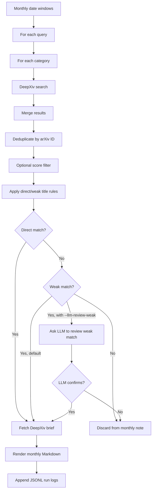

# High-Velocity Star Literature Workflow

This workspace collects monthly arXiv/DeepXiv literature notes for high-velocity star related research. The current default workflow is DeepXiv-first: use DeepXiv search for broad recall, split searches by arXiv category, deduplicate locally, use fast title rules to classify direct and weak relevance, and fetch DeepXiv brief only for papers that pass title triage. Weak rule matches can optionally be reviewed by an LLM.

## Directory Layout

```text
stella-workspace/
  README.md
  .env                         # Local DeepXiv token and LLM config, not committed
  scripts/
    env.example                # Example DeepXiv and LLM env vars
    fetch_high_velocity_lit.py # Main CLI entrypoint
    run_2025_2026.sh           # Convenience wrapper for 2025 and 2026-to-date
  src/high_velocity_lit/
    config.py                  # Default queries, categories, limits, model defaults
    models.py                  # Shared dataclasses
    deepxiv_client.py          # DeepXiv SDK wrapper and token loading
    arxiv_client.py            # Optional arXiv API fallback client
    title_classifier.py        # Direct/weak title rules plus optional LLM review
    pipeline.py                # Search, dedupe, classify, brief, render orchestration
    markdown.py                # Monthly note and index rendering
    filters.py                 # Category/score helpers and legacy rule helpers
  notes/
    index.md                   # Monthly index
    YYYY-MM.md                 # One literature note per month
  logs/
    runs.jsonl                 # One summary record per run
    run_<timestamp>.log        # Detailed JSONL event log for each run
```

## Environment

Run commands in the project conda environment:

```bash
conda activate stella-env
```

Use the project-local `.env` file for the DeepXiv token and optional LLM title-review settings. The file is ignored by Git, so local secrets stay out of commits.

```env
DEEPXIV_TOKEN=
LLM_API_KEY=
LLM_BASE_URL=https://api.openai.com/v1
LLM_MODEL=gpt-4o-mini
```

You can copy the template and fill it:

```bash
cp /Users/willzhang/Documents/MyProject/Stella_Project/stella-workspace/scripts/env.example \
   /Users/willzhang/Documents/MyProject/Stella_Project/stella-workspace/.env
```

The script automatically loads env vars from:

```text
~/.env
stella-workspace/.env
current-working-directory/.env
```

For this project, keep `DEEPXIV_TOKEN` in `stella-workspace/.env` so runs launched from the workspace use the same project-local token. Command-line flags such as `--token`, `--llm-api-key`, `--llm-base-url`, and `--llm-model` override environment values.

## Default Search Scope

Default queries:

```text
hypervelocity stars
hypervelocity star
high velocity stars
high-velocity stars
runaway stars
OB runaway stars
unbound stars
escaping stars
```

Default categories:

```text
astro-ph.GA
astro-ph.SR
astro-ph.IM
```

DeepXiv does not behave like OR when multiple categories are passed together. Therefore the pipeline searches each category separately and deduplicates locally.

## Workflow



Default title triage is rule-based and does not call an LLM. Direct rules include titles that explicitly mention hypervelocity/high-velocity stars, runaway stars, unbound/escaping/ejected stars, stellar escapers, or walkaway stars. Weak rules catch likely mechanism or proxy topics such as stellar ejection mechanisms, potential/cluster escapers, bow shocks, Galactic-center ejection language, stellar interactions in dense systems, and unusual stellar kinematics.

With `--llm-review-weak`, direct rule matches are still accepted immediately, but weak rule matches are batched into the LLM for confirmation. This keeps the default run fast while allowing a higher-precision hybrid mode when needed.

DeepXiv brief is fetched only after title triage returns `include=true`. This keeps DeepXiv brief usage focused on likely relevant papers.

## Usage

Run the default 2025 plus 2026-to-date job:

```bash
bash /Users/willzhang/Documents/MyProject/Stella_Project/stella-workspace/scripts/run_2025_2026.sh
```

Run a single month:

```bash
conda run -n stella-env python /Users/willzhang/Documents/MyProject/Stella_Project/stella-workspace/scripts/fetch_high_velocity_lit.py \
  --source deepxiv \
  --classifier rules \
  --start-year 2026 \
  --start-month 3 \
  --end-year 2026 \
  --end-month 3 \
  --max-results 20
```

Run rules-only without fetching DeepXiv brief, useful for testing search and title triage:

```bash
conda run -n stella-env python /Users/willzhang/Documents/MyProject/Stella_Project/stella-workspace/scripts/fetch_high_velocity_lit.py \
  --source deepxiv \
  --classifier rules \
  --start-year 2026 \
  --start-month 3 \
  --end-year 2026 \
  --end-month 3 \
  --max-results 20 \
  --no-brief
```

Use the hybrid mode to send only weak rule matches to the LLM:

```bash
conda run -n stella-env python /Users/willzhang/Documents/MyProject/Stella_Project/stella-workspace/scripts/fetch_high_velocity_lit.py \
  --source deepxiv \
  --classifier rules \
  --llm-review-weak \
  --start-year 2026 \
  --start-month 3 \
  --end-year 2026 \
  --end-month 3 \
  --max-results 20
```

## Important Options

```text
--source deepxiv|arxiv       Candidate search backend. Default: deepxiv.
--classifier llm|rules|none  Title relevance check. Default: rules.
--llm-review-weak            With rules, send weak rule matches to the LLM.
--categories A,B,C           Category fan-out for DeepXiv search.
--max-results N              Top N results per query/category.
--min-score X                Optional DeepXiv score floor. Default: disabled.
--no-brief                   Skip DeepXiv brief calls.
--llm-api-key KEY            Override LLM_API_KEY.
--llm-base-url URL           Override LLM_BASE_URL.
--llm-model MODEL            Override LLM_MODEL.
--llm-batch-size N           Number of candidate titles per LLM call. Default: 25.
```

## Output Notes

Each monthly Markdown note includes:

```text
- date range
- run id and time
- search source, categories, title classifier mode
- raw unique candidates and title-classifier pass count
- confirmed papers with arXiv link, PDF link, score, matched queries/categories
- classifier decision label, confidence, and reason
- direct-rule, weak-rule, and weak-LLM review counts
- DeepXiv brief and arXiv abstract
- per-query/category search summary
```

The detailed run log is JSONL. Main event types:

```text
start      # run configuration
query      # one DeepXiv/arXiv search call
classify   # one LLM/rule classifier batch
brief      # one DeepXiv brief call
month_done # monthly summary
finish     # run summary
```

## Quota Model

With default DeepXiv-first settings:

```text
Search calls per month = number_of_queries * number_of_categories
Default = 8 * 3 = 24 DeepXiv search calls/month
Brief calls per month = number of papers accepted by title triage
LLM calls per month = 0 by default, or ceil(weak_rule_candidates / llm_batch_size) with --llm-review-weak
```

For the 2025 plus 2026-to-date job, the DeepXiv search call count is approximately:

```text
16 months * 8 queries * 3 categories = 384 search calls
```

Brief calls are much lower because they are only made after title triage.

## Notes On Accuracy

The current classifier is title-only by design. Default rules are much faster than full LLM review, but they can miss papers whose titles are vague and only reveal relevance in the abstract. Direct rules prioritize high precision. Weak rules increase recall for mechanism/proxy topics, and `--llm-review-weak` can filter those weak matches when precision matters. To increase recall, raise `--max-results`, add more query phrases, or expand weak rules in `title_classifier.py`. To reduce false positives, tighten weak rules, enable `--llm-review-weak`, lower `--max-results`, or add a score floor with `--min-score`.
