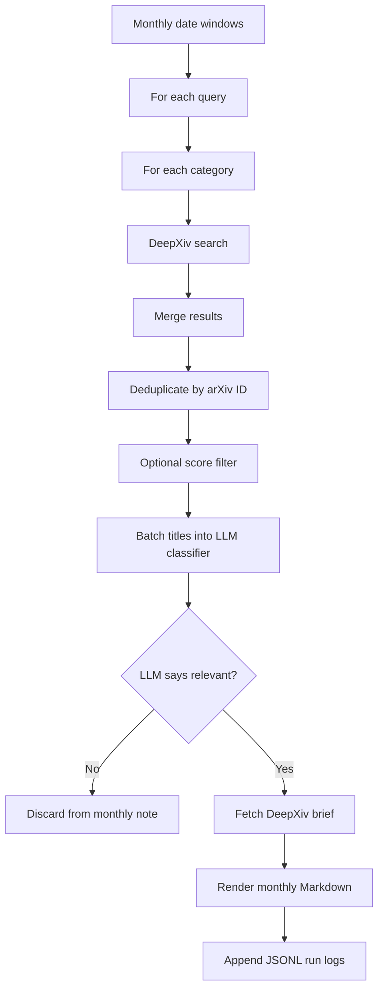

# High-Velocity Star Literature Workflow

This workspace collects monthly arXiv/DeepXiv literature notes for high-velocity star related research. The current default workflow is DeepXiv-first: use DeepXiv search for broad recall, split searches by arXiv category, deduplicate locally, use an LLM to judge title relevance, and fetch DeepXiv brief only for papers that pass the title check.

## Directory Layout

```text
stella-workspace/
  README.md
  .env                         # Local LLM config, not required if using ~/.env
  scripts/
    env.example                # Example LLM env vars
    fetch_high_velocity_lit.py # Main CLI entrypoint
    run_2025_2026.sh           # Convenience wrapper for 2025 and 2026-to-date
  src/high_velocity_lit/
    config.py                  # Default queries, categories, limits, model defaults
    models.py                  # Shared dataclasses
    deepxiv_client.py          # DeepXiv SDK wrapper and token loading
    arxiv_client.py            # Optional arXiv API fallback client
    title_classifier.py        # LLM title classifier and rule-based test classifier
    pipeline.py                # Search, dedupe, classify, brief, render orchestration
    markdown.py                # Monthly note and index rendering
    filters.py                 # Category/score helpers and legacy rule helpers
  notes/
    index.md                   # Monthly index
    YYYY-MM.md                 # One literature note per month
  logs/
    runs.jsonl                 # One summary record per run
    run_<timestamp>.log        # Detailed JSONL event log for each run
```

## Environment

Run commands in the project conda environment:

```bash
conda activate stella-env
```

DeepXiv uses `DEEPXIV_TOKEN`, which can live in `~/.env`, the shell environment, or conda env vars. The LLM title classifier uses OpenAI-compatible environment variables:

```env
LLM_API_KEY=
LLM_BASE_URL=https://api.openai.com/v1
LLM_MODEL=gpt-4o-mini
```

You can copy the template and fill it:

```bash
cp /Users/willzhang/Documents/MyProject/Stella_Project/stella-workspace/scripts/env.example \
   /Users/willzhang/Documents/MyProject/Stella_Project/stella-workspace/.env
```

The script automatically loads env vars from:

```text
~/.env
stella-workspace/.env
current-working-directory/.env
```

Command-line flags such as `--llm-api-key`, `--llm-base-url`, and `--llm-model` override environment values.

## Default Search Scope

Default queries:

```text
hypervelocity stars
hypervelocity star
high velocity stars
high-velocity stars
runaway stars
OB runaway stars
unbound stars
escaping stars
```

Default categories:

```text
astro-ph.GA
astro-ph.SR
astro-ph.IM
```

DeepXiv does not behave like OR when multiple categories are passed together. Therefore the pipeline searches each category separately and deduplicates locally.

## Workflow



The LLM classifier only sees title and category. It is asked to include papers likely about hypervelocity stars, high-velocity stars, runaway stars, OB runaways, unbound/ejected/escaping stars, stellar escapers, walkaway stars, or mechanisms/observations/kinematics of those populations. Papers about compact stars, neutron stars, impacts, cratering, generic binary stars, AGN simulations, or ordinary stellar populations should be excluded unless the title clearly suggests the target topic.

DeepXiv brief is fetched only after the LLM returns `include=true`. This keeps DeepXiv brief usage focused on likely relevant papers.

## Usage

Run the default 2025 plus 2026-to-date job:

```bash
bash /Users/willzhang/Documents/MyProject/Stella_Project/stella-workspace/scripts/run_2025_2026.sh
```

Run a single month:

```bash
conda run -n stella-env python /Users/willzhang/Documents/MyProject/Stella_Project/stella-workspace/scripts/fetch_high_velocity_lit.py \
  --source deepxiv \
  --classifier llm \
  --start-year 2026 \
  --start-month 3 \
  --end-year 2026 \
  --end-month 3 \
  --max-results 20
```

Run without fetching DeepXiv brief, useful for testing search and LLM classification:

```bash
conda run -n stella-env python /Users/willzhang/Documents/MyProject/Stella_Project/stella-workspace/scripts/fetch_high_velocity_lit.py \
  --source deepxiv \
  --classifier llm \
  --start-year 2026 \
  --start-month 3 \
  --end-year 2026 \
  --end-month 3 \
  --max-results 20 \
  --no-brief
```

Use the rule-based classifier only for offline sanity checks:

```bash
conda run -n stella-env python /Users/willzhang/Documents/MyProject/Stella_Project/stella-workspace/scripts/fetch_high_velocity_lit.py \
  --source deepxiv \
  --classifier rules \
  --start-year 2026 \
  --start-month 3 \
  --end-year 2026 \
  --end-month 3 \
  --max-results 5 \
  --no-brief
```

## Important Options

```text
--source deepxiv|arxiv       Candidate search backend. Default: deepxiv.
--classifier llm|rules|none  Title relevance check. Default: llm.
--categories A,B,C           Category fan-out for DeepXiv search.
--max-results N              Top N results per query/category.
--min-score X                Optional DeepXiv score floor. Default: disabled.
--no-brief                   Skip DeepXiv brief calls.
--llm-api-key KEY            Override LLM_API_KEY.
--llm-base-url URL           Override LLM_BASE_URL.
--llm-model MODEL            Override LLM_MODEL.
--llm-batch-size N           Number of candidate titles per LLM call. Default: 25.
```

## Output Notes

Each monthly Markdown note includes:

```text
- date range
- run id and time
- search source, categories, LLM model
- raw unique candidates and title-classifier pass count
- confirmed papers with arXiv link, PDF link, score, matched queries/categories
- LLM decision label, confidence, and reason
- DeepXiv brief and arXiv abstract
- per-query/category search summary
```

The detailed run log is JSONL. Main event types:

```text
start      # run configuration
query      # one DeepXiv/arXiv search call
classify   # one LLM/rule classifier batch
brief      # one DeepXiv brief call
month_done # monthly summary
finish     # run summary
```

## Quota Model

With default DeepXiv-first settings:

```text
Search calls per month = number_of_queries * number_of_categories
Default = 8 * 3 = 24 DeepXiv search calls/month
Brief calls per month = number of papers accepted by the LLM
LLM calls per month = ceil(unique_candidates / llm_batch_size)
```

For the 2025 plus 2026-to-date job, the DeepXiv search call count is approximately:

```text
16 months * 8 queries * 3 categories = 384 search calls
```

Brief calls are much lower because they are only made after title classification.

## Notes On Accuracy

The current classifier is title-only by design. This saves DeepXiv brief quota, but it can miss papers whose titles are vague and only reveal relevance in the abstract. To increase recall, raise `--max-results`, add more query phrases, or change the classifier prompt in `title_classifier.py` to be more inclusive. To reduce false positives, lower `--max-results`, add a score floor with `--min-score`, or make the classifier prompt stricter.

